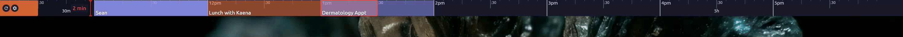

# What's Happening?
A sliding calendar strip that always shows you what's happening next. Optimized for those with "event-based time keeping" brains.

Here is what it looks like at 20x speed:



## Table of Contents
- [USER_GUIDE.md](USER_GUIDE.md) — How to use "What's Happening?" (End-user docs)
- [Docs](docs/) — Architecture, Decisions, and PRD
- [Agents](agents/) — Persona documentation and CHAT.md
- [App](app/) — Flutter application source code

## TL;DR
What's Happening? is a persistent, always-on-top horizontal timeline strip that reads your Google Calendar events and animates them in real time toward a fixed "Now" indicator. It's designed specifically for event-based thinkers (including those with ADHD) to provide immediate, glanceable awareness of their day without the cognitive load of a full calendar grid.

---

## Project Status: v0.5.1
- [x] **Sprint 1**: Foundation & Shell (Always-on-top window, mock timeline)
- [x] **Sprint 2**: Google Calendar Integration (OAuth flow, real event fetching, polling)
- [x] **Sprint 3**: Refactor & Polish (Hover details, settings, platform optimization)
- [x] **Sprint 4**: Linux Release + Test Pyramid (v0.1.0 shipped)
- [x] **Sprint 5**: v0.2.0 Features (Multi-Calendar, Themes, Visual Polish, PKCE auth)
- [x] **Sprint 6**: v0.3.0 Linux window sizing, hover card fixes, always-visible quit button
- [x] **v0.3.1**: Secure credential storage, OAuth cancellation, calendar isolation, settings panel polish
- [x] **v0.4.0**: Display/DPI metric refresh, Windows AppBar reservation recovery, refresh-button overlap fix
- [x] **Send-to-Back (F-27)**: Removed fragile C++ pass-through; strip can be temporarily lowered behind other windows for 10 seconds cross-platform
- [x] **Linux Reserved Space (F-28)**: Robust window struts/docks for X11/XWayland without complex plugins
- [x] **Astronomical Theme (F-29)**: Local day/night gradient background with sunrise, sunset, moon rise/set times and real-time moon phase display
- [x] **v0.5.1**: Bundled GeoNames offline city coordinate search (33,742 cities), system-locale 12/24h time formatting, and event z-ordering fixes

---

## Installing (End Users)

Download the latest release for your platform from the [releases page](https://github.com/drusifer/happening/releases).

> **No extra setup required.** Authentication uses PKCE OAuth via a hosted proxy — no API keys or client secrets needed.

### Runtime Requirements

| Platform | Requirement |
|----------|-------------|
| macOS    | macOS 12 Monterey or later |
| Linux    | GTK 3 (`libgtk-3`) — pre-installed on most modern distros |
| Windows  | Windows 10 or later, Visual C++ Redistributable (usually already installed) |

### macOS
1. Download `happening-<version>-macos-arm64.dmg` (or `x64` for Intel Macs).
2. Open the `.dmg` and drag `happening.app` to your `/Applications` folder.
3. Eject the disk image.
4. On first launch, right-click → **Open** (to bypass Gatekeeper on unsigned builds).
5. Sign in with Google when prompted — a browser window will open automatically.

### Linux
1. Download `happening-<version>-linux-x64.tar.gz`.
2. Extract and run:
    ```bash
    tar -xzf happening-<version>-linux-x64.tar.gz
    ./bundle/happening
    ```
3. Sign in with Google when prompted.

### Windows
1. **Microsoft Store (Recommended)**: Download and install What's Happening? directly from the [Official Microsoft Store](https://apps.microsoft.com/detail/9nnj0vk9g85p?hl=en-US&gl=US). This handles background updates and offers the easiest configuration.
2. **Manual release**: Alternatively, download `happening-<version>-windows-x64.msix` or the `.zip` for a portable install from our [releases page](https://github.com/drusifer/happening/releases). Double-click the `.msix` to install, or extract the `.zip` and run `happening.exe` inside the `Release/` folder.
3. Sign in with Google when prompted — a browser window will open automatically.

---

## Building from Source (Developers)

### Build Requirements

These are only needed if you are building from source. End users do not need these.

#### macOS
- Flutter SDK (>= 3.19.0)
- Xcode (>= 14) with Command Line Tools (`xcode-select --install`)
- CocoaPods (`sudo gem install cocoapods`)

#### Linux
- Flutter SDK (>= 3.19.0)
- `clang`, `cmake`, `ninja-build`, `pkg-config`
- `libgtk-3-dev`
- `lld` (LLVM linker)
- `libsecret-1-dev` *(required for secure credential storage)*
- `libsecret-tools` *(required for unlocking the keyring)*

#### Windows
- Flutter SDK (>= 3.19.0)
- Visual Studio with "Desktop development with C++" workload

---

## Getting Started (Developers)

### 1. Setup
Verify your system dependencies and fetch Flutter packages:
```bash
# On Linux, this checks for required packages. On other OSes, it just runs pub get.
make setup
```

### 2. Run in Development
Run the app on your desktop.
```bash
make run-linux    # Linux, using X11/XWayland for stable strip placement
make run-macos    # macOS
make run-windows  # Windows
make run          # Lists all options
```

---

## Building

### Release Builds
- **Linux**: `make build-linux` → `app/build/linux/x64/release/bundle/`
- **macOS**: `make build-macos` → `app/build/macos/Build/Products/Release/happening.app`
- **Windows**: `make build-windows` → `app/build/windows/x64/runner/Release/`

### Distribution Packages
- **Linux**: `make dist-linux` → `dist/happening-<ver>-linux-x64.tar.gz`
- **macOS**: `make dist-macos` → `dist/happening-<ver>-macos-<arch>.dmg`
- **Windows**: `make dist-windows` → `dist/happening-<ver>-windows-x64.zip`

---

## Testing & Quality
- **Run unit tests**: `make test`
- **Run integration tests**: `make integration-test-linux`, `make integration-test-macos`, or `make integration-test-windows`
- **Static analysis**: `make analyze`
- **Format code**: `make format`

---

## Architecture Overview
- **Framework**: Flutter (Desktop)
- **Window Management**: `window_manager` for frameless, always-on-top behavior. Linux runs on X11/XWayland because native Wayland does not support reliable absolute strip placement. Platform-specific resize sequences (`WindowResizeStrategy`) and docking strategies (`ReservedWindowInteractionStrategy`, `MacOsWindowInteractionStrategy`) manage screen strut alignment. `WindowService` manages real-time DPI changes, and can trigger **Send-to-Back** (lowering the window behind other apps via `XLowerWindow` or platform APIs) with a 10-second automatic restore timer.
- **Rendering**: Decomposed into composited custom painter layers (`BackgroundLayer`, `PastOverlayLayer`, `TickLayer`, `NowIndicatorLayer`, `EventsLayer`). Under the **Astronomical** theme, `AstronomicalBackgroundLayer` takes over to draw horizontal gradients reflecting daylight/twilight/moonlight, and `SolarMarkerLayer` and `LunarMarkerLayer` draw celestial events. Events are rendered above tick lines in the final paint pass.
- **State Management**: `StreamBuilder` driven by a 1Hz clock tick. `AsyncGate<T>` serializes async window operations and deduplicates rapid intent changes.
- **Hover / Focus**: `TimelineFocusController` coordinates expand/collapse and the Send-to-Back timer. Hovering over an event latches the detail card open.
- **Auth**: PKCE OAuth flow with cancellable `HttpServer` redirect capture. Credentials persisted via `FlutterSecureTokenStore` (OS keychain on all platforms).
- **Data**: Google Calendar API v3 via `googleapis`. Per-calendar fetches are isolated and catch errors individually.
- **Geocoding / Astronomy**: Offline calculations powered by a local GeoNames dataset containing 33,742 cities (`assets/data/cities.csv` fetched via `make fetch-cities`). Used to compute coordinates, dawn/dusk boundaries, solar angles, and 8-phase moon visualizations offline without external web API calls.
