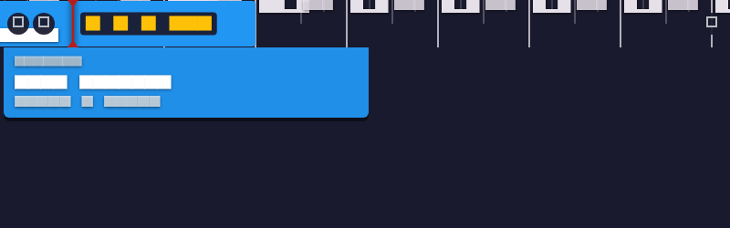

# User Guide — Happening

Welcome to Happening! This guide will help you understand how to use the timeline strip and get the most out of your schedule.

---

## 1. What is Happening?

Happening is a **persistent, always-on-top horizontal timeline strip** that lives at the top of your screen. It shows your Google Calendar events flowing toward a fixed "Now" indicator in real time.

> "The schedule comes to you."

---

## 2. GUI Overview

---

## 3. Understanding the Interface

### The Strip
The strip is always visible at the top of your primary display. It stays above other windows, providing immediate awareness of your day without the cognitive load of a full calendar grid.

### Now Indicator & Countdown
- **Now Line**: A fixed vertical line at the 10% mark.
- **Future/Past**: Future events flow from right to left toward the Now line.
- **Countdown**: A precise 1-second timer showing the time until your next transition (e.g., "38 min"). It turns **Amber** during meetings and **Red/Flashing** when a transition is imminent (< 2 min).

### Events & Tasks
- **Event Blocks**: Solid colored blocks representing meeting durations.
- **Task Markers (◇)**: Diamond-shaped markers for tasks or zero-duration items.
- **Collision Detection**: Overlapping events are drawn with red outlines and transparency. **Note: Shorter events are always drawn on top** so you can easily hover over them.

---

## 4. Interaction Features

### Latch-on-Expand Hover
Happening uses "Smart Bounding" to make interaction stable:
1. **Selection**: Hover over any event on the strip to expand its detail card.
2. **Stability (The Latch)**: Once a card is open, the hit-zone expands to the full width of the card. This "latches" the card open, allowing you to move your mouse horizontally to click the **JOIN** or **OPEN** buttons without accidentally switching to an adjacent event.
3. **Dismiss**: Move your mouse outside the card area to collapse the window.

### Action Buttons
- **JOIN**: Opens your video call link (Meet, Zoom, Teams, etc.) instantly.
- **OPEN**: Opens the event directly in your Google Calendar web interface.

---

## 5. Settings & Customization

Click the **Gear** icon on the far left to open the Settings Panel:

- **Theme**: Switch between **Dark**, **Light**, and **System** themes.
- **Time Window**: Control how many hours of your day are visible (8h, 12h, or 24h).
- **Multi-Calendar**: Toggle visibility for all your synced Google Calendars.
- **Font Size**: Adjust the UI scale. The strip height adapts automatically.
- **Quit & Logout**: Use the dedicated buttons in the header to exit the app or switch accounts.

---

## 6. Performance & Efficiency

Happening is optimized for ultra-low CPU usage:
- **Tiered Updates**: The main timeline repaints every 10 seconds, while the countdown timer updates every 1 second.
- **Idle Mode**: Animations and high-frequency timers automatically deactivate when no transitions are imminent.

---

## 7. Troubleshooting

- **Strip Positioning**: If the strip appears in the center of the screen (Linux/Wayland), ensure `GDK_BACKEND=x11` is set.
- **Transparency**: The area below the strip is transparent to your desktop. If it appears as a solid black/white box, verify your system's compositor settings.

---

## 8. Feedback & Bugs
Reach out to us at [drusifer@gmail.com].
