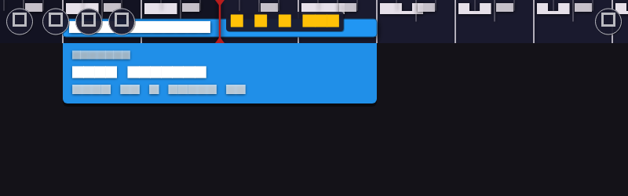
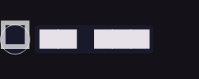

# User Guide — What's Happening?

Welcome to "What's Happening?"! This guide will help you understand how to use the timeline strip and get the most out of your schedule.

---

## 1. What is "What's Happening?"

"What's Happening?" is a **persistent, always-on-top horizontal timeline strip** that lives at the top of your screen. It shows your Google Calendar events flowing toward a fixed "Now" indicator in real time.

> "The schedule comes to you."

---

## 2. GUI Overview

---

## 3. First Launch & Sign-In

On first launch the strip shows:

> **Tap to sign in with Google →**

Tap anywhere on the strip to open a Google sign-in page in your browser. Once you authorize "What's Happening?", the browser closes and the timeline appears automatically.

**Credentials are stored securely in your OS keychain** — you only need to sign in once. On subsequent launches the app restores your session automatically.

### Cancelling a sign-in
If the browser opens but you change your mind, the strip shows:

> **Signing in… tap to cancel**

Tap anywhere on the strip to abort the OAuth flow. The strip returns to the "Tap to sign in" state immediately.

---

## 4. Understanding the Interface

### The Strip
The strip is always visible at the top of your primary display. It stays above other windows, providing immediate awareness of your day without the cognitive load of a full calendar grid.

### Now Indicator & Countdown
- **Now Line**: A fixed vertical line at the 10% mark.
- **Future/Past**: Future events flow from right to left toward the Now line.
- **Countdown**: A precise 1-second timer showing the time until your next transition (e.g., "38 min"). It turns **Amber** during meetings and **Red/Flashing** when a transition is imminent (< 2 min).

### Events & Tasks
- **Event Blocks**: Solid colored blocks representing meeting durations.
- **Task Markers (◇)**: Diamond-shaped markers for tasks or zero-duration items.
- **Collision Detection**: Overlapping events are drawn with red outlines and transparency. **Note: Shorter events are always drawn on top** so you can easily hover over them.
- **Z-Order Refinement**: Calendar events are painted on top of tick lines for maximum readability, preventing lines from dividing your visual schedule. Tick time labels remain perfectly legible.

---

## 5. Interaction Features

### Latch-on-Expand Hover
"What's Happening?" uses "Smart Bounding" to make interaction stable:
1. **Selection**: Hover over any event on the strip to expand its detail card.
2. **Stability (The Latch)**: Once a card is open, the hit-zone expands to the full width of the card. This "latches" the card open, allowing you to move your mouse horizontally to click the **JOIN** or **OPEN** buttons without accidentally switching to an adjacent event.
3. **Dismiss**: Move your mouse outside the card area to collapse the window.

### Action Buttons
- **JOIN**: Opens your video call link (Meet, Zoom, Teams, etc.) instantly.
- **OPEN**: Opens the event directly in your Google Calendar web interface.

### Send-to-Back
If "What's Happening?" is blocking a window title bar, browser tab, or menu that you need to access:
- **Activate**: Tap the **Send to Back** (`⧉` flip icon) on the strip.
- **Temporary Lowering**: The strip immediately lowers itself behind all other active desktop windows. You can now resize, move, or click whatever was obscured underneath.
- **Auto-Restore**: An inactivity timer automatically restores the strip to its always-on-top position after exactly **10 seconds**.
- **Non-Intrusive Focus**: When the strip auto-restores to the front, it does so quietly without stealing keyboard focus from whatever application you are currently typing in.
- **Continuous Lowering**: If you need more time to interact with underlying windows, simply tap the Send-to-Back button again before the 10 seconds expire to reset and extend the timer for another 10 seconds.

### Timestrip Hide/Show
For times when you need maximum screen space but still want to keep an eye on your schedule:
- **Hide the Strip**: Tap the **Hide** (`←` left arrow) button on the far left of the strip.
- **Mini Widget State**: The strip collapses into a tiny **Mini Widget** anchored at the top-left of your screen.
- **Strut & Reservation Release**: On Linux and Windows, hiding the strip automatically releases the reserved screen space (Linux struts and Windows AppBars), allowing maximized applications to occupy the full screen.
- **Continuous Countdown**: The mini widget continues to display the live countdown to your next transition (amber during meetings, red/flashing when imminent), keeping you aware of the time remaining.
- **Restore the Strip**: Tap the **Show** (`→` right arrow) button in the mini widget, or tap the **Countdown Area** itself, to instantly restore the strip to its full size (and re-acquire reserved screen space).
- **Default Visibility**: The app always launches fully visible.

---

## 6. Strip Controls & Settings

### Always-Visible Strip Buttons
Five icon buttons are always visible on the strip (once signed in):
- **Hide** (`←` left arrow, far left) — collapses the timeline strip to a mini widget.
- **Refresh** — re-fetches your calendar events. On Windows, also reasserts the reserved space at the top of the screen.
- **Send to Back** (`⧉` flip icon) — temporarily lowers the strip behind all other windows for 10 seconds, then auto-restores it to the top. Press again to reset the timer. Useful when the strip is covering something you need to see.
- **Settings** (gear icon) — opens the settings panel.
- **Quit** (power icon, far right) — exits the app at any time, even before signing in.

### Settings Panel
Click the **Gear** icon to open the Settings Panel:

- **Theme**: Switch between **Dark**, **Light**, **System**, and **Astronomical** themes.
  - **Light Theme**:
    
  - **Dark Theme**:
    
- **Time Window**: Control how many hours of your day are visible (8h, 12h, or 24h).
- **Multi-Calendar**: Toggle visibility for all your synced Google Calendars.
- **Font Size**: Adjust the UI scale. The strip height adapts automatically.
- **Logout**: The **LOGOUT** button inside the settings panel signs you out and clears your calendar selection (ready for a different account).
- **Quit**: The **power icon** (⏻) on the far right of the strip is always visible — click it at any time to exit the app, even before signing in.

---

## 7. Astronomical Theme & Location Settings

For an organic, visual connection to your day, select the **Astronomical** theme under settings. This overlays sunrise, sunset, moonrise, and moonset events directly onto the timeline scale, complete with dynamically rendered skies and accurate moon phase visualizations.

### Dynamic Sky Backgrounds
The timeline strip renders a beautiful day/night gradient representing the natural progression of light based on your local coordinates:
- **Midnight Sky**: A deep, night-navy gradient (`#0A0E1A`) when the sun is below the horizon.
- **Twilight Transitions (Dawn & Dusk)**: A warm orange/pink transition gradient (`#FF8C42`) that shifts smoothly at civil twilight begin and end boundaries, preventing sudden visual jumps.
- **Daylight**: A clear, calming sky blue (`#87CEEB`) when the sun is above the horizon.

### Timeline Celestial Markers
Celestial bodies and boundaries are marked at their precise daily times along the timeline scale:
- **Sunrise (🌅)**: Anchored exactly at the start of civil twilight (dawn begin).
- **Sunset**: Anchored exactly at the end of civil twilight (dusk end).
- **Solar Noon**: Marked by a small solar marker at the sun's peak elevation.
- **Moonrise & Moonset**: A moon icon representing your **actual local moon phase** (New Moon, Waxing/Waning Crescent, First/Last Quarter, Waxing/Waning Gibbous, or Full Moon) rises with an upward arrow and sets with a downward arrow at their exact daily times.
- **Tonight's Moon Phase Badge**: A static moon phase badge is always displayed at the far right of the strip (near the settings gear) showing tonight's phase name and illumination percentage (e.g., `Waxing Gibbous 72%`), regardless of whether moonrise/set are inside the currently scrolled timeline window.

### Offline & Zero Network Dependencies
All solar, twilight, and lunar data calculations are performed locally and offline on your computer. There are absolutely no external network requests or API dependencies for the Astronomical theme!

### Configuring Your Location (Offline GeoNames Search)
To compute precise times, the app needs your latitude and longitude. When you select the **Astronomical** theme, a **Location** section will appear in the settings panel:
1. In the text field, type your city name (e.g. `Boston`, `Berlin`, `Tokyo`).
2. Click the **Search** icon (or press Enter). The app queries a built-in, local database of **33,742 cities** completely offline.
3. Once your city is found, its coordinates and name will be previewed.
4. Click **Confirm** to save the location. The coordinates are stored securely in your app settings, and astronomical markers will instantly project onto your timeline strip!

---

## 8. Performance & Efficiency

"What's Happening?" is optimized for ultra-low CPU usage:
- **Tiered Updates**: The main timeline repaints every 10 seconds, while the countdown timer updates every 1 second.
- **Idle Mode**: Animations and high-frequency timers automatically deactivate when no transitions are imminent.

---

## 9. Troubleshooting

- **Windows overlap after changing display scale or resolution**: Click the **Refresh** icon on the left side of the strip. It refreshes calendar events and asks Windows to reapply the reserved space at the top of the screen.
- **Strip Positioning**: If the strip appears in the center of the screen (Linux/Wayland), ensure `GDK_BACKEND=x11` is set.
- **Transparency**: The area below the strip is transparent to your desktop. If it appears as a solid black/white box, verify your system's compositor settings (compositing must be enabled).
- **Hover card not expanding (Linux)**: If hovering over an event does nothing, try a full app restart. Linux uses the same resize path as macOS via the `window_manager` API.

---

## 10. Feedback & Bugs
Reach out to us at [drusifer@gmail.com].
