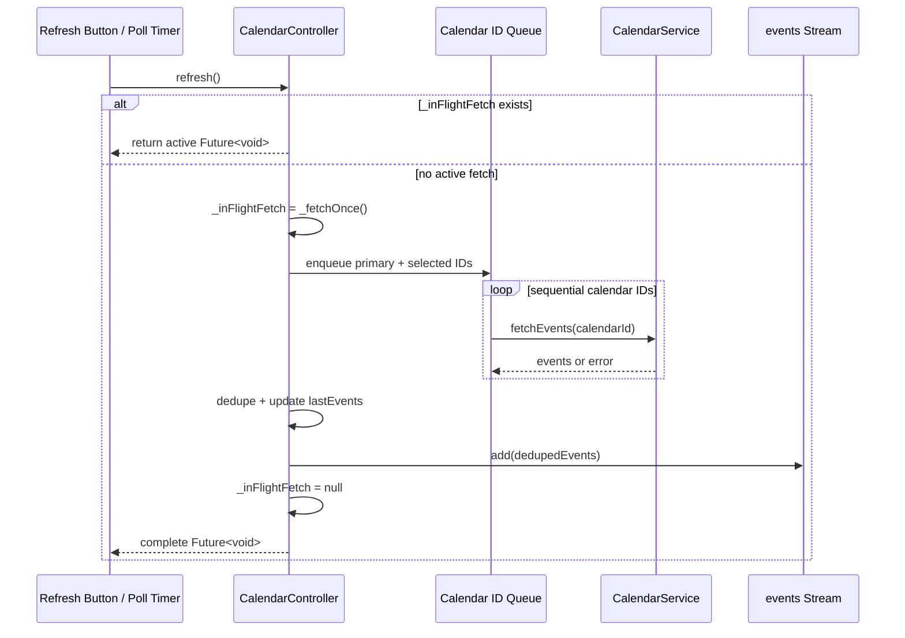

# Calendar Fetch Threading Architecture — 2026-04-17T19:59

## Problem
The app froze after rapid manual refresh activity. The debug log showed several overlapping `CalendarController._fetch(forceRefresh: true)` calls immediately before logging stopped. Each fetch fans out across every selected calendar, so repeated refresh taps can multiply network calls and stream emissions.

Google Calendar `events.list` is one calendar per request. `freeBusy.query` accepts multiple calendars, but it does not return event details needed by the timeline cards. Happening must still fetch selected calendars individually.

## Binding Decision
Use a two-level concurrency model:

1. Controller-level single-flight fetch.
2. Per-calendar fetch queue inside that single flight.

Manual refresh requests are not queued. If a fetch is already in flight, a new `refresh()` call must be ignored as work, but return the active in-flight `Future<void>` as the completion signal.

## Required Semantics
- `CalendarController.refresh()` remains the completion signal. Callers can `await` it to know the active fetch has completed.
- `CalendarController.events` remains the data signal. It emits only after a fetch completes and dedupes events.
- While `_inFlightFetch != null`, `refresh()` must not enqueue a follow-up fetch.
- Polling ticks while `_inFlightFetch != null` must also be ignored.
- Fetching selected calendars must use a queue, not `Future.wait`.
- The queue should start with concurrency `1` for maximum safety. If latency becomes unacceptable later, introduce an explicit `maxConcurrentCalendarFetches` parameter with a small default and tests.
- Per-calendar failures remain isolated: one failed calendar logs a warning and contributes `[]`; successful calendars still emit.

## Sequence

## Implementation Constraints For Neo
- Replace the current `Future.wait(idsToFetch.map(...))` fan-out with sequential queue processing.
- Keep the current `_inFlightFetch != null` single-flight guard.
- Remove queued follow-up state and tests. There should be no `_queuedForceRefresh` or `while (true)` loop.
- Update the existing regression test named `overlapping refresh calls coalesce...` to assert ignored refreshes:
  - Start a blocking refresh.
  - Call `refresh()` twice more.
  - Assert `fetchCalls == 1` while pending.
  - Complete the first fetch.
  - Await all three returned futures.
  - Assert `fetchCalls == 1`.
- Add a queue-order test with selected calendars:
  - settings selected calendar `secondary`
  - start refresh
  - assert only `primary` is requested first
  - complete primary
  - assert `secondary` is requested next
  - complete secondary
  - assert exactly two calls total

## Non-Goals
- Do not use Google `freeBusy.query`; it cannot replace event detail fetches.
- Do not add UI spinner/disable behavior in this pass unless requested. The controller `Future<void>` is sufficient as the current completion signal.
- Do not introduce isolates or OS threads. Dart async plus explicit scheduling is enough.

